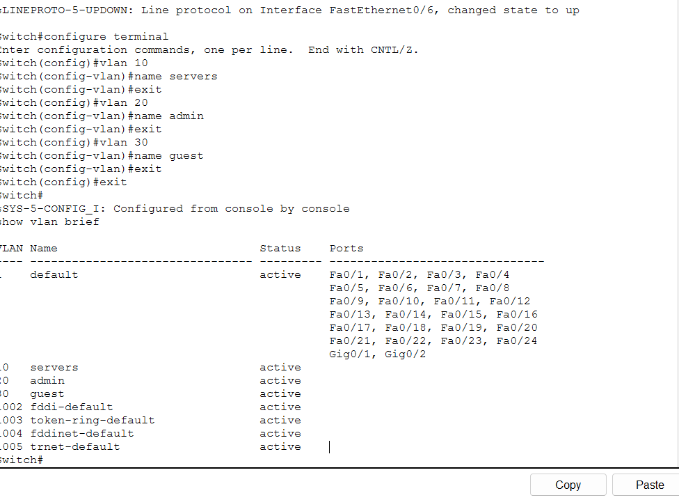
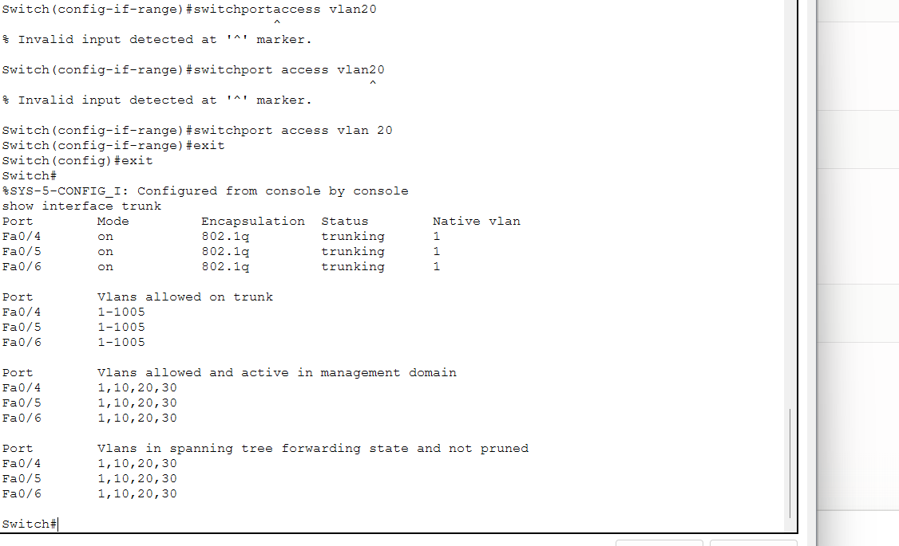
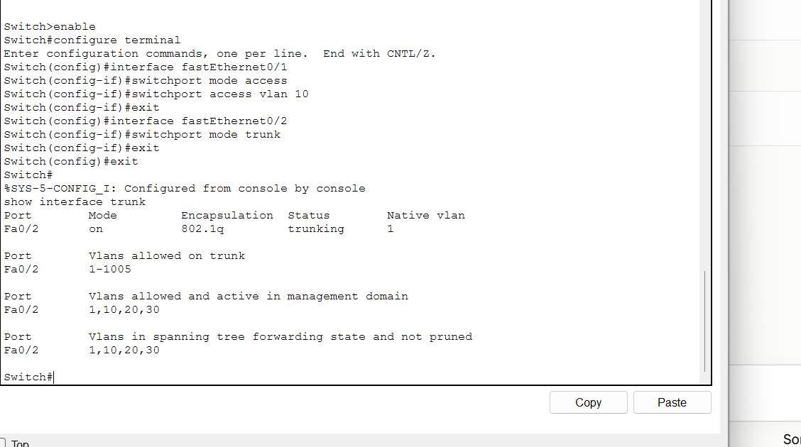
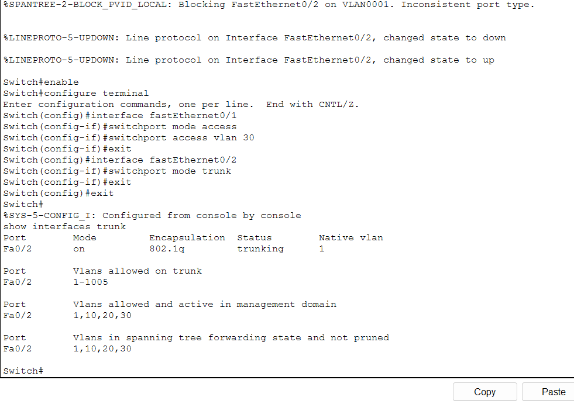
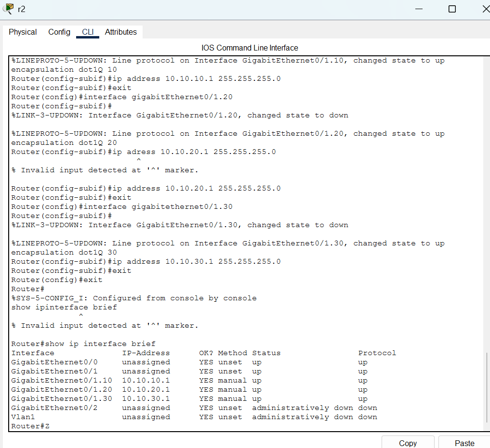
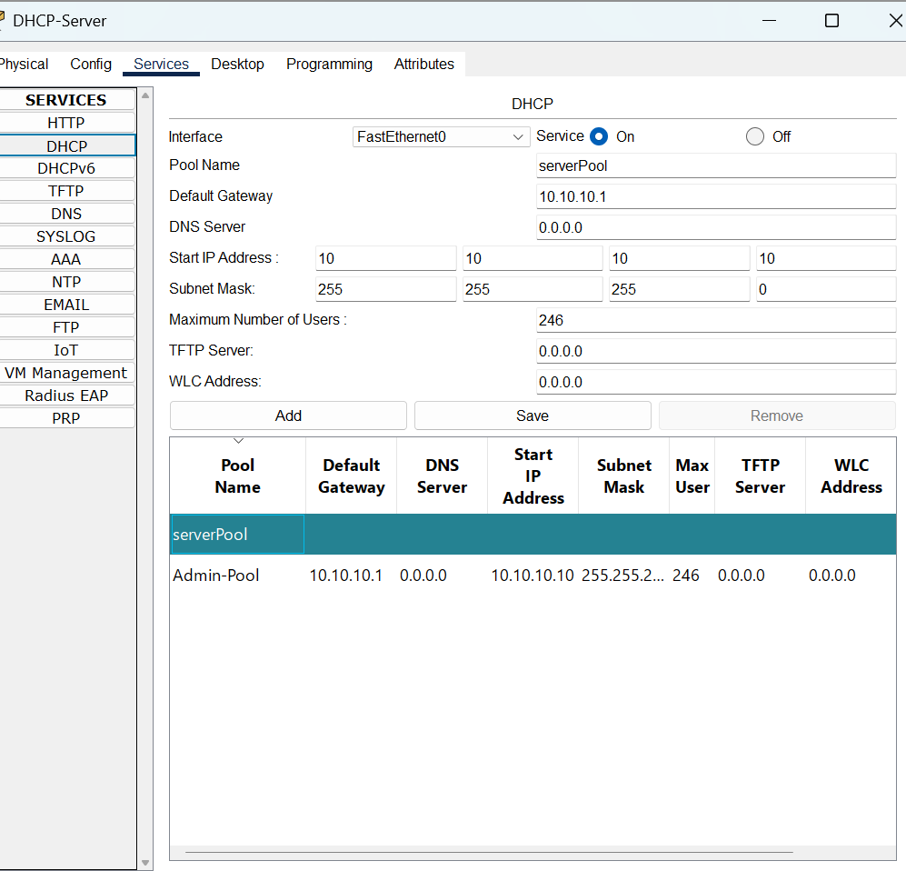

# BranchNet-Lab

A small enterprise network built in GNS3 to practice the stuff that actually breaks in real networks — VLAN segmentation, inter-VLAN routing, DHCP scoping, ACL-based access control, and basic uptime monitoring.

I built this after realizing most of my networking knowledge was theoretical — I could explain what a VLAN does but had never actually watched one fail because of a native VLAN mismatch. This lab exists to close that gap.

```
                     ┌────────────┐
                     │  R1 (Edge)  │
                     │  WAN link   │
                     └──────┬──────┘
                            │ Gi0/0
                     ┌──────┴──────┐
                     │  R2 (Core)  │
                     │ Router-on-  │
                     │ a-stick     │
                     └──────┬──────┘
                            │ Gi0/1
                            │ (single trunk, carries
                            │  VLANs 10/20/30)
                       ┌────┴────┐
                       │  SW1    │
                       └────┬────┘
                       trunk│  trunk
                      ┌─────┴┐  ┌┴─────┐
                      │ SW2  │  │ SW3  │
                      └──────┘  └──────┘

  VLANs 10 (Servers), 20 (Admin), 30 (Guest) are trunked to
  all three switches — access ports for each VLAN can sit on
  whichever switch is physically convenient.
```

## Why this setup

Three VLANs, each with a different trust level, is enough to force you to deal with real routing and security decisions:

- **VLAN 10 (Servers)** — internal services, only Admin should reach this
- **VLAN 20 (Admin)** — management traffic, full access everywhere
- **VLAN 30 (Guest)** — internet only, no access to Servers or Admin

## What's actually configured

- A single trunk link (Gi0/1) from R2 down to SW1, carrying all three VLANs via 802.1Q; SW1 trunks onward to SW2 and SW3
- Router-on-a-stick on R2 — one physical interface, three subinterfaces (one per VLAN), each acting as the default gateway for its VLAN
- DHCP is provided by a dedicated server sitting in the Admin VLAN; R2's subinterfaces use `ip helper-address` to relay DHCP broadcasts from the Servers and Guest VLANs to that server
- Extended ACLs on R2 controlling inter-VLAN traffic — Guest can reach the internet but is denied access to Servers and Admin; Admin can reach both other VLANs; Servers are reachable from Admin but denied to Guest
- A Python script (`monitor.py`) that pings every host + gateway on a 30-second loop, logs state changes to a timestamped file, and flags anything down for more than 2 consecutive checks (avoids false alarms from a single dropped packet)

## Build order (what I actually did, in order)

1. Bring up R1, R2, and the three switches in GNS3, wire the topology above
2. Configure the R2↔SW1 trunk first, and the inter-switch trunks (SW1↔SW2, SW1↔SW3) second. Verify each with `show interfaces trunk` before touching VLANs — trying to configure VLANs before trunks were confirmed working just wastes time chasing the wrong problem
3. Create VLANs 10/20/30 on each switch, assign access ports
4. Configure the three subinterfaces on R2 (`Gi0/1.10`, `.20`, `.30`), each with `encapsulation dot1Q <id>` and an IP acting as gateway
5. Set up a dedicated DHCP server in the Admin VLAN, then add `ip helper-address` pointing to it on each of the other subinterfaces so their broadcasts get relayed
6. Write and test ACLs one VLAN at a time — apply, test, adjust, rather than writing all three ACLs blind and debugging them together
7. Bring up the monitoring script last, once the network is actually in a working state, so you're not trying to debug two things at once

## Troubleshooting log

This is the part that actually matters more than the config itself — anyone can copy commands off a Cisco doc, the useful part is what went wrong and how I found it.

**Issue 1 — Inter-VLAN traffic wasn't routing at all**
Pinged from a Servers VLAN host to an Admin VLAN host, got nothing. First assumption was the ACL. Wrong — `show ip interface brief` on R2 showed the subinterfaces as `administratively down`. Traced it back to the parent physical interface (`Gi0/1`) still being shut down from before I'd started the subinterface config. Since a subinterface's line protocol depends on its parent, the subinterfaces stayed unavailable even though their own configuration looked correct. Easy to miss because I was only reading the subinterface config, not the parent's actual state.

**Issue 2 — Trunk was up but VLAN 30 traffic wasn't crossing it**
Trunk showed active, but Guest VLAN devices couldn't reach their gateway. `show interfaces trunk` on both switches showed the native VLAN as 1 on one end and 99 on the other (a leftover from testing native VLAN changes for security). Mismatched native VLANs don't always throw an obvious error — traffic on the native VLAN just gets misdelivered or dropped silently. Set both ends to match and it cleared immediately.

**Issue 3 — Guest VLAN clients weren't getting DHCP leases**
Admin and Servers VLANs pulled addresses fine, Guest didn't. Traced it to the `ip helper-address` command being applied on the wrong subinterface — I'd pasted the config from VLAN 20's subinterface and forgot to update the interface context before applying it to VLAN 30. `show run interface <sub>` per subinterface caught it. DHCP relay issues are almost always this — a helper address either missing or pointing at the wrong place, not the DHCP server itself being broken.

**Issue 4 — ACL was blocking traffic it shouldn't have**
Admin VLAN lost access to Servers VLAN entirely after I added the Guest-blocking ACL. Cause: ACLs have an implicit deny at the end, and my Admin `permit` statement was placed *after* a broader `deny ip any any` I'd added while testing the Guest rule. Order matters — ACL entries are processed top to bottom and stop at the first match, so a permit rule sitting below a matching deny never gets evaluated. Reordered so specific permits come before general denies.

**Issue 5 — Monitoring script showed hosts flapping up/down constantly**
`monitor.py` was flagging hosts as down every few cycles even though nothing was actually wrong with the network. Traced it to where the monitoring host itself was sitting — it was on an interface where the ACL restricted its outbound traffic, so its own ping probes were the ones being blocked, not the destination hosts actually failing. Moved the monitoring host to the Admin VLAN, where it has legitimate access to everything it needs to check, and kept the two-consecutive-failure threshold as a safety margin against ordinary single dropped packets.

**Issue 6 — Every host showed as DOWN when testing the script on Windows**
Ran `monitor.py` on a Windows machine and every single host — including known-good ones like `8.8.8.8` — showed as down within the first two checks. First guess was a network/firewall problem, but a direct manual `ping 8.8.8.8` in the same terminal worked fine, which ruled that out immediately. The actual cause: the script's `ping` call used Linux/Mac flags (`-c` for count, `-W` for timeout), and Windows' `ping` uses different flags entirely (`-n` for count, `-w` for timeout in milliseconds). Windows doesn't throw a clear error for unrecognized flags in this case — the command just fails silently, which made it look identical to a real outage. Added a `platform.system()` check so the script picks the right flag set depending on OS. Good reminder that "it works on my machine" is doing a lot of work when your monitoring tool is the thing lying to you about the network being down.

## monitor.py — what it does

- Pings a configurable list of IPs (gateways + representative hosts per VLAN)
- Logs every state change (up→down, down→up) with a timestamp to `network_log.txt`
- Requires 2 consecutive failed pings before marking something down, to filter out single dropped packets
- Prints a running status summary to the terminal every cycle
- Detects reachability failures — a host or gateway not responding to ICMP. It doesn't diagnose *why* (bad cable, failed NIC, misconfigured interface); it just flags that something needs a closer look. Root-causing still means logging into the actual device.

## Configuration evidence

Screenshots from the actual build, in order. (Topology was rebuilt once after a session crash — these are the CLI outputs from the working configuration, not staged.)

**VLANs created on SW1:**


**Trunk ports up on SW1 (Fa0/4, Fa0/5, Fa0/6 — to SW2, SW3, R2):**


**SW2 — access port for Servers VLAN + trunk to SW1:**


**SW3 — access port for Guest VLAN + trunk to SW1 (note the brief STP inconsistency-then-recovery, expected behavior when both trunk ends come up):**


**R2 — three subinterfaces up with inter-VLAN gateway addresses:**


**DHCP pools configured per VLAN:**


## What I'd add next

- SNMP polling instead of just ICMP, to get actual interface counters and error rates, not just reachability
- A second WAN link on R1 with basic failover, since right now a single link failure takes the whole lab offline
- Syslog forwarding from R2 to a central log host instead of relying on the monitoring script alone

## Requirements

- GNS3 with an IOS image for the routers/switches (or IOSv/IOSvL2 images)
- Python 3 for `monitor.py` (uses only `subprocess` and `time`, no external dependencies)
